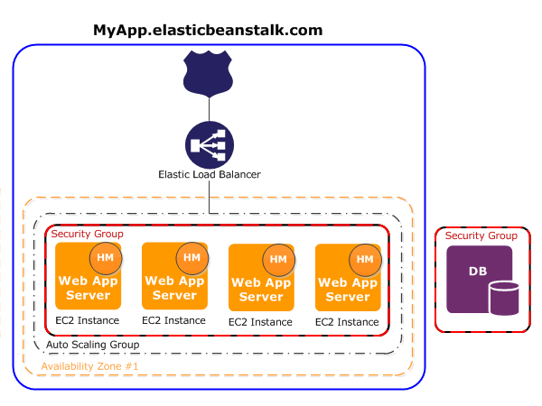

# Potfolio Website (AWS Elastic Beanstalk Deployment)

## Link
https://ramapranadi.com/ 

## Architecture of deployment
  

The goal of this portfolio was to:
- showcase skills and projects
- Deploy and host on AWS using Auto Scaling Groups, EC2s, Load Balancers, Security Groups, and Route 53
- build a Django app with low redundancy, aligning with the philosophy of "don't Repeat Yourself"
    - using tempalte inheritance, granularizing as many objects as possible
    - using context data
- target audience: hiring managers and recruiters

## AWS
- Elastic Beanstalk deployment
- Leveraged Load Balancers, Auto Scaling Groups, EC2, Security groups, and Route 53

## Built On

- Python 3.11.5
- Django 5.0.2
- Boostrap 5 (CDN)
- jQuery (CDN)
- HTMX (CDN)
- Other dependencies listed in the `requirements.txt` file

Open a browser and go to `https://ramapranadi.com/ to view the site.

